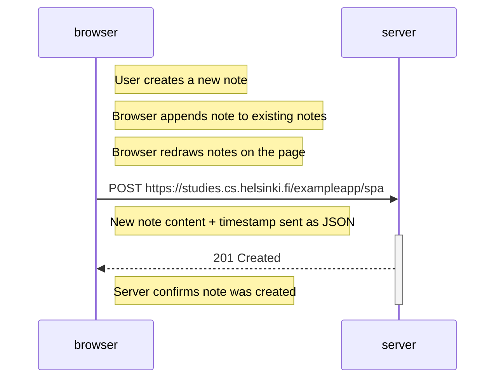

```mermaid
sequenceDiagram
    participant browser
    participant server

    Note right of browser: User creates a new note
    Note right of browser: Browser appends note to existing notes
    Note right of browser: Browser redraws notes on the page

    browser->>server: POST https://studies.cs.helsinki.fi/exampleapp/spa
    Note right of browser: New note content + timestamp sent as JSON

    activate server
    server-->>browser: 201 Created
    Note right of browser: Server confirms note was created
    deactivate server
```

